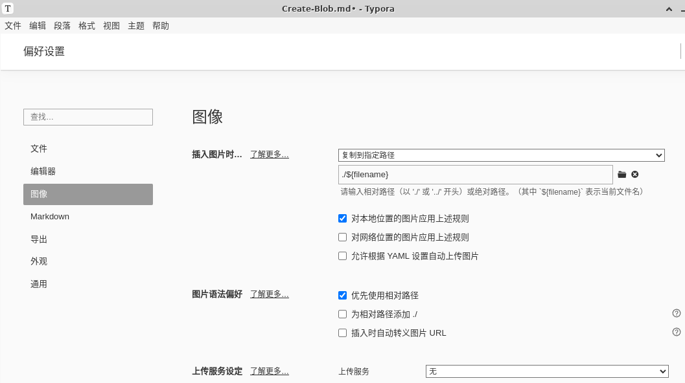

写博客的好处多多，一直以来有所耳闻，最近在读的《奔跑吧，程序员》中也有提到，遂趁着动力还在，赶紧落实。求快先Google了一下，流行的Github Pages建博客的方案有：Hexo、Jekyll、Hugo等。我机器上有node环境，直接选Hexo。<!--more-->

# 安装

1. 安装Node.js
2. 安装Hexo

```shell
npm install hexo-cli -g
hexo init <folder>
cd <folder>
npm install
```

# 写博客

## 创建文章

使用`hexo new`命令创建新文章

```shell
hexo new [layout] <title>
```

* `layout`指布局，默认有三种：`post`、`page` 和 `draft`，会使用scaffolds文件夹中的对应md文件来创建新文章。
  
  | layout | 功能                     | 模板位置           | 文章路径        |
  | ------ | ------------------------ | ------------------ | --------------- |
  | post   | 文章（默认）             | scaffolds/post.md  | source/_posts/  |
  | page   | 页面（标签页，分类页等） | scaffolds/page.md  | source/         |
  | draft  | 草稿                     | scaffolds/draft.md | source/_drafts/ |
  
* `title`是指文章的名称，如果有空格需要使用引号包围，生成的文件名会将空格替换成“-”。

## 草稿操作

### 创建草稿

```bash
hexo new draft <title>
```

### 预览草稿

1. 执行 hexo generate命令时加上 --draft 参数
2. 在 _config.yml 文件中把 render_drafts 参数设为 true

### 发布草稿

```bash
hexo publish [layout] <title>
```

## 插入图片

1. 在_config.yml将post_asset_folder设置为true
2. 创建文章时会同时创建文章名文件夹来放图片
3. 使用``或``引入图片
4. 可以结合一些Markdown编辑器的配置，更方便地插入图片，如Typora中可以设置插入图片时的规则：
   


# 配置

## 网站配置

博客网站的基础配置在`_config.yml`文件中，顶部配置一些网站的基本信息。以下是我的博客配置示例：

```yaml
title: Draw's Blog!
subtitle: 欢迎
description: 欢迎欢迎
keywords: null
author: DrawGu
language: zh-CN
timezone: Asia/Shanghai
url: https://drawgu.github.io
```

其它配置参看[官方配置文档](https://hexo.io/zh-cn/docs/configuration)

## 主题

我选择NexT主题，NexT应该是Hexo最受欢迎的主题之一。

安装NexT很简单，步骤：

1. 将NexT所有文件放到`themes/next`目录下，可以在Github直接下载zip解压后拷贝进去，我这边直接将Next项目clone进`themes/next`目录

```bash
$ cd <Hexo所在目录>
$ git clone https://github.com/next-theme/hexo-theme-next themes/next
```

2. 将`_config.yml`中的`theme`设置成`next`
3. 在博客根目录创建`_config.next.yml`文件，作为NexT的配置文件，将`themes/next/_config.yml`中全部内容拷贝到`_config.next.yml`文件中

## 阅读更多设置

默认情况下文章会首页显示全部内容，这样会让用户难以看到除第一篇文章外的其它文章。这时我们希望首页显示文章的部分摘要，点击“阅读更多”进入文章页查看完整文章。

Hexo中有两种方案：

1. 在文章中添加`<!--more-->`，那么 `<!-- more -->` 之前的文字将会被视为摘要，在此之后的内容需要点击“阅读更多”查看。

2. 在 Front Matter 中的添加 `excerpt` 参数。Front-matter 是文件最上方以 `---` 分隔的区域，用于指定文章的一些属性。

   ```yaml
   ---
   title: Hello World
   date: 2013/7/13 20:46:25
   excerpt: 这是文章摘要这是文章摘要这是文章摘要这是文章摘要
   ---
   ```

> `<!--more-->`和`excerpt`参数都有的话，`excerpt`参数优先级更高。

# 部署

先在本地部署，查看博客效果，再部署到GitHub Pages。

## 本地

### 生成静态页

```bash
hexo generate
```

生成静态文件，可简写为`hexo g`；使用`-d`或`--deploy`文件生成后立即部署网站；使用`-f`或`--force`强制重新生成文件，类似`hexo clean && hexo generate`

### 部署网站

```bash
hexo deploy
```

部署网站，可简写为`hexo d`；添加`-g`或`--generate`在部署之前预先生成静态文件，同`hexo generate && hexo deploy`。

### 启动本地服务

```bash
hexo server
```

启动服务器。默认情况下，访问网址为： `http://localhost:4000/`；使用`-p`或`--proxy`可指定端口。

### 清除缓存

```bash
hexo clear
```

可简写为`hexo cl`

### 一把梭

```bash
hexo cl && hexo g -d
```

## GitHub Pages

1. 将hexo文件夹push到`<GitHub用户名>.github.io`仓库的main分支

2. 开启GitHub Actions：前往 `Settings > Pages > Source`，并将 `Source` 改为 `GitHub Actions`。

3. 在.github/workflows创建pages.yml文件，文件内容如下，其中node-version值改成和本地node版本一致，使用`node --version` 命令获取：

   ```yml
   name: Pages
   
   on:
     push:
       branches:
         - main # default branch
   
   jobs:
     build:
       runs-on: ubuntu-latest
       steps:
         - uses: actions/checkout@v3
           with:
             token: ${{ secrets.GITHUB_TOKEN }}
             # If your repository depends on submodule, please see: https://github.com/actions/checkout
             submodules: recursive
         - name: Use Node.js 16.x
           uses: actions/setup-node@v2
           with:
             node-version: '16'
         - name: Cache NPM dependencies
           uses: actions/cache@v2
           with:
             path: node_modules
             key: ${{ runner.OS }}-npm-cache
             restore-keys: |
               ${{ runner.OS }}-npm-cache
         - name: Install Dependencies
           run: npm install
         - name: Build
           run: npm run build
         - name: Upload Pages artifact
           uses: actions/upload-pages-artifact@v2
           with:
             path: ./public
     deploy:
       needs: build
       permissions:
         pages: write
         id-token: write
       environment:
         name: github-pages
         url: ${{ steps.deployment.outputs.page_url }}
       runs-on: ubuntu-latest
       steps:
         - name: Deploy to GitHub Pages
           id: deployment
           uses: actions/deploy-pages@v2
   ```

4. 前往 `https://<GitHub用户名>.github.io` 查看网站。

# 参考

1. [从零开始免费搭建自己的博客(二)](https://yushuaige.github.io/2021/01/01/%E4%BB%8E%E9%9B%B6%E5%BC%80%E5%A7%8B%E5%85%8D%E8%B4%B9%E6%90%AD%E5%BB%BA%E8%87%AA%E5%B7%B1%E7%9A%84%E5%8D%9A%E5%AE%A2(%E4%BA%8C)%E2%80%94%E2%80%94%E5%9F%BA%E4%BA%8E%20GitHub%20pages%20%E5%BB%BA%E7%AB%99)

2. [从零开始搭建你的个人博客 Hexo+Github Pages 详解](https://www.meow-2.com/posts/records/how-to-build-your-own-website-from-zero)

3. [hexo官方中文文档](https://hexo.io/zh-cn/docs/)

4. [NexT官方文档](https://theme-next.js.org/)

5. [hexo使用](https://www.cnblogs.com/leskang/p/14044259.html)
