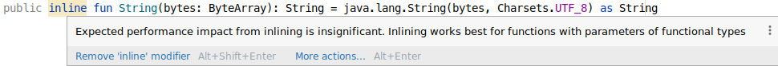
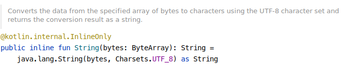
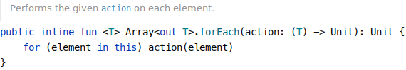
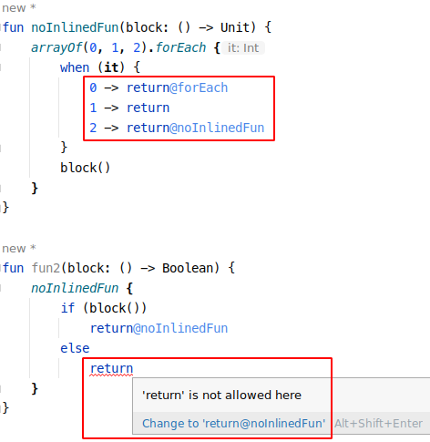
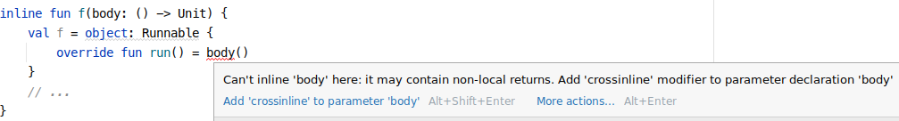
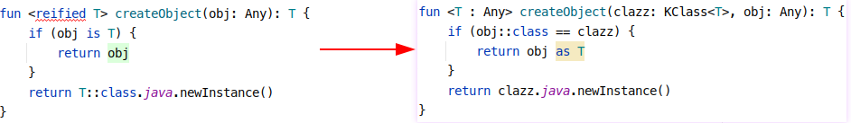
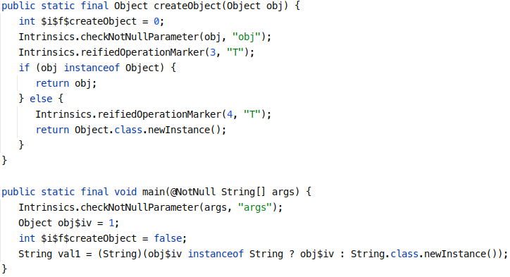

# Kotlin中的inline

## 简介

在C++ 中，使用inline函数理论上可以加速程序运行，因为它们消除了与函数调用关联的开销。 调用函数需要将返回地址推送到堆栈、将参数推送到堆栈、跳转到函数体，然后在函数完成时执行返回指令。 通过inline函数可以消除此过程。

然而在Kotlin中，函数调用的开销实则没有像C/C++那么性能敏感，如果我们随便找个函数加个inline实际会收到以下Warning：



> 虽然除了Kotlin自己提供的一些语法糖会这么用（只许州官放火，不许百姓点灯？）：
>
> StringsJVM.kt
>
> 

这个警告的意思是建议将`inline`用在参数有函数类型的高阶函数上。但如果你要一定要用，可以使用`@Suppress("NOTHING_TO_INLINE")`可以关闭这个扰人的警告。

## 高阶函数（Higher-Order Functions）中的 inline

Java语言中一切皆对象，kotlin最终编译成的字节码在jvm中运行时也都是对象。高阶函数中的函数类型参数最终会转换成kotlin.jvm.functions.FunctionX类对象（X代表入参个数，FunctionN代表不定参数入参函数）。


这样会导致对象&类的数量膨胀，虚拟调用也会增加运行时开销。

要避免这种情况，kotlin引入了inline：



## `noinline`

顾名思义：不要内联。

默认情况下`inline`函数的所有函数参数都会被内联，但是有些情况下我们不需要内联，如将函数类型参数赋值到上级作用域的其它字段（产生副作用），或传递这个函数类型参数给非`inline`函数使用。

看一下如下代码：

```kotlin
class InlineDemo {
    var callback: (() -> Unit)? = null
    inline fun foo(inlined: () -> Unit, noinline notInlined: () -> Unit) {
        callback = inlined//错误：Illegal usage of inline-parameter xx in xxx
        callback = notInlined
        inlinedFun(inlined)
        inlinedFun(notInlined)
        notInlinedFun(inlined)//错误：Illegal usage of inline-parameter xx in xxx
        notInlinedFun(notInlined)
    }
    inline fun inlinedFun(inlined: () -> Unit) {}
    fun notInlinedFun(notInlined: () -> Unit) {}
}
```

`foo`函数中因为是内联的，`inlined`是无法赋值给`callback`字段的，因为编译后`inlined`的实现代码直接被copy到了调用`foo`的地方，因此运行时不存在`inlined`这个对象，自然也无法作为非`inline`函数类型入参使用；非`inline`的函数类型参数最终会转化成上面提到的`FunctionX`类对象。

然而`noinline`标识的`notInlined`参数就没有以上限制。

## `crossinline`

因为`inline`内联本质上是拷贝替换代码，`return`语句也不例外。如下代码：

```kotlin
inline fun inlinedFun(block: () -> Unit) {
    println("++++ inlinedFun")
    block()
    println("---- inlinedFun")
}

fun main() {
    inlinedFun {
        println("@@@@ inlinedFun")
        return
    }
    println("Done!")
}
```

`main`方法最后内联后的代码如下：

```kotlin
fun main() {
    println("++++ inlinedFun")
    println("@@@@ inlinedFun")
    return//return也内联了，后面代码不执行了
    println("---- inlinedFun")
    println("Done!")
}
```

如果只想`return`这个lambda，只需在`return`后添加`@inlinedFun`

```kotlin
fun main() {
    inlinedFun {
        println("@@@@ inlinedFun")
        return@inlinedFun
    }
    println("Done!")
}
```

实际上后面没有@的`return`在非inline的lambda中无法使用，必须指定`return@哪哪`，如下图：



`forEach`是inline内联函数，传入的lambda中`return@外层`、`return@内层`、纯`return`都可以使用，其中纯`return`等于`return@外层`，这种返回官方还给个名，叫非局部返回（*non-local* returns）；在非inline的lambda的`return`必须@当前层。

`crossinline`就是用来标识禁止非局部返回的，借用官方列子：

```kotlin
inline fun f(crossinline body: () -> Unit) {
    val f = object: Runnable {
        override fun run() = body()
    }
    // ...
}

fun sample() {
    f {
        println()
        return//出错
        println()
    }
}
```

显然在`sample`中调用f时传入的`return`是做不到退出sample的，无法做到所谓的非局部返回。

假如把body前的`crossinline`去除，也是会报错的：



因为此处`body`不直接在`f`函数中跑，最终在另一个执行上下文中运行，这种情况肯定无法做到非局部返回。官方提供了`crossinline`关键字来标识。

### `return`为何这样设计的猜测？

纯`return`代表返回当前所在的函数；但是非内联的lambda实际上是没有这个能力的，非内联的lambda最终会被编译成对象，其内部逻辑还可能会在不同线程中运行。它永远只能退出当前lambda，无法结束外层的函数，官方提供了`return@label`来退出当前lambda；假设非内联的lambda也能使用纯`return`：

```kotlin
fun sampleFun(shouldReturn: () -> Boolean) {
    notKnownIfInlinedFun {
        if (shouldReturn()) {
            return
        } else {
            doSomething()
        }
    }
}
```

在`notKnownIfInlinedFun`中的`return`就会因为`notKnownIfInlinedFun`是否是内联的不一致：内联时`return == return@sampleFun`；非内联`return==return@notKnownIfInlinedFun`，这样的代码你必须去弄清楚`notKnownIfInlinedFun`是否是内联的，而且破坏了“纯`return`代表返回当前所在的函数”这个概念。

## reified

泛型在运行时会被擦除：

```kotlin
fun <T> createObject(): T {
    return T::class.java.newInstance()//出错，运行时类型被擦除
}
```

要实现这个创建方法，需要修改一下，手动传入类型：

```kotlin
fun <T : Any> createObject(clazz: KClass<T>): T {
    return clazz.java.newInstance()
}
```

kotlin中引入了一种简便写法`inline`+`reified`：

```kotlin
inline fun <reified T> createObject(): T {
    return T::class.java.newInstance()
}
```

`inline`的函数能作为普通函数给Java调，但是有`reified`参数的不能。

如上`createObject`编译后会生成普通函数：


泛型擦除后生成的普通函数和原来代码相比都不是一个意思了，给Java调没什么意义。

### 为什么`reified`一定要在`inline`函数上使用？

如果需要实现单独使用`reified`，因为泛型编译成字节码后会被擦除，运行时如果需要保留泛型类型信息，可以添加入参传入类型，如下左边的代码编译后应该等于右边代码



这样的话Java中只能如下调用：

在kotlin中的调用方式就不好整了，如果用下面的方式调用。

```kotlin
val str = createObject<String>("")
```

编译后得插入获取`KClass<String>`的代码。

总之，调用端运行时必须明确知道reified的类型。

且明明是个N个参数的函数，最终编译后实际成了N+1参数的函数，那重载时还得将`reified`关键字纳入考量。整得很复杂。容易使开发者迷惑。

而`reified`配合`inline`时，在编译期将泛型中的`reified`类型也内联，可谓天作之合。如下例子：

```kotlin
inline fun <reified T> createObject(obj: Any): T {
    if (obj is T) {
        return obj
    }
    return T::class.java.newInstance()
}

fun main(args: Array<String>) {
    val str = createObject<String>(1)
}
```

内联时，编译过程中直接将`T`这个类型使用调用处的`String`替换，函数`createObject`调用处拷贝`createObject`函数中代码替换。

实际上`main`中的`createObject`调用内联后大概是这样的：

```kotlin
fun main(args: Array<String>) {
    val obj: Any = 1
    val temp: String = if (obj is String) {
        obj
    } else {
        String::class.java.newInstance()
    }
}
```

与字节码反编译代码基本一致。最终生成的字节码反编译后如图：

如果要实现`reified`在非内联的时候使用，需要加很多”戏“，又是实现复杂，又是使用限制，官方没整。

个人感觉更有可能是`inline`整好了，官方发现内联函数遇到泛型也内联一下似乎不错，就加了个`reified`。

### 有`reified`类型就自动inline函数吧，为啥多写个`inline`？

为了可读性，既然`inline`了就应该标明，而且`inline`能提醒开发者，这个是`inline`函数，有`inline`函数限制。

## `inline`函数的一些限制

Kotlin 不允许在 `public` 或 `protected` 的内联函数中使用 `private` 或 `internal` 成员。

### 限制原因

Kotlin 的 inline 函数在编译时会将函数体内联到调用处，这意味着内联函数的内容直接复制到调用点。这种特性带来了性能上的优势，但也引入了一些二进制兼容性的问题。为了理解这个限制，详细解释如下：

1. **二进制兼容性**：
   - 当一个模块声明了一个 `public` 或 `protected` 的内联函数，这个函数可以被其他模块调用。由于内联函数在编译时将其函数体直接插入到调用处，如果函数体中调用了某些 `private` 或 `internal` 函数，当这些`private` 或 `internal` 函数修改后，不重新编译调用模块可能会导致运行时错误或行为不一致。
2. **可见性问题**：
   - 如果 `public` 或 `protected` 的内联函数调用涉及到 `private` 或 `internal` 的成员变量，这些成员变量在另一个模块中不可见，内联后会因为可见性限制导致错误。

### 解除限制方法：`@PublishedApi` 

一个 `internal` 声明可以由 `@PublishedApi` 标注，这会允许它在公有 API 内联函数中使用。 当一个 `internal` 内联函数标记有 `@PublishedApi` 时，也会像公有函数一样检测其函数体。

> 但是`private`成员没这个待遇，它是kotlin中最小的可见性范围，封装性和安全性需要保证，只能在声明它们的文件中内部可见。

## 参考资料

- https://juejin.cn/post/7078207132453044238

- https://stackoverflow.com/questions/70352154/why-to-use-inline-when-using-a-reified-type
- https://stackoverflow.com/questions/45348820/using-return-inside-a-lambda
- https://stackoverflow.com/questions/45949584/how-does-the-reified-keyword-in-kotlin-work
