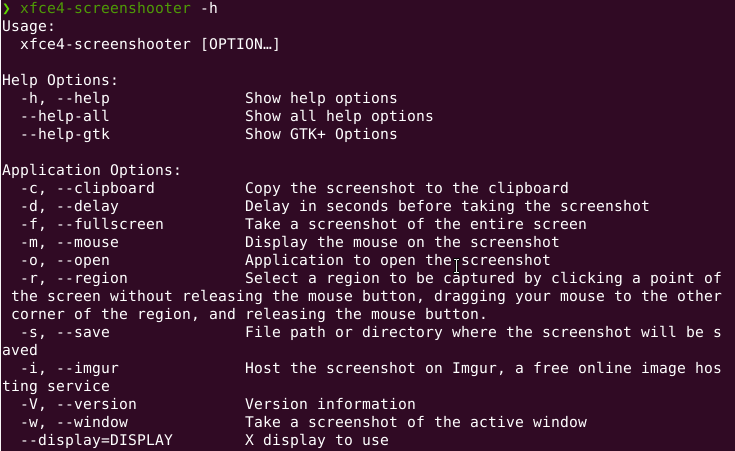
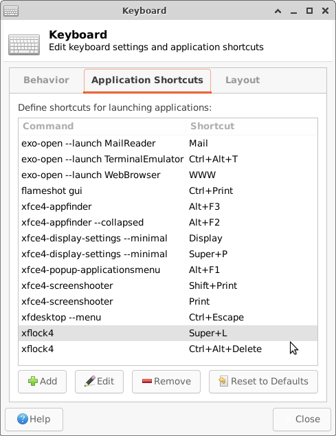
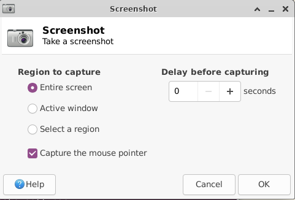
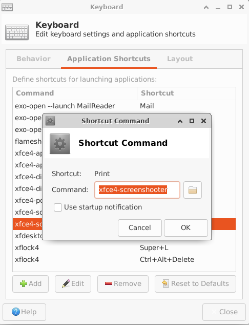
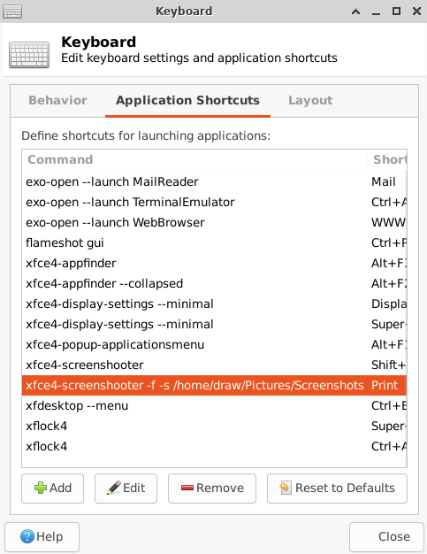
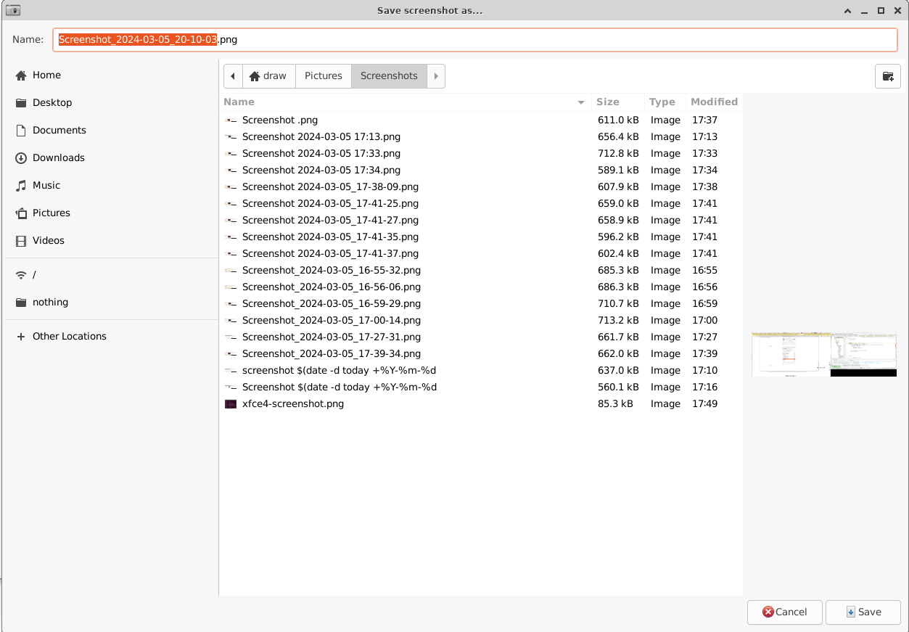
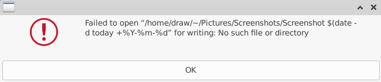
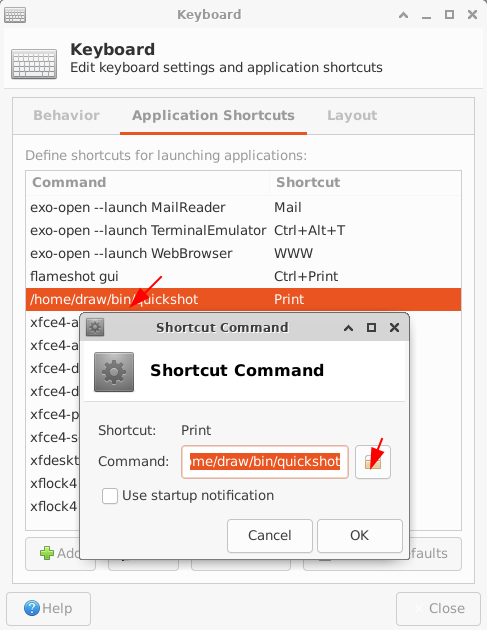

## 背景

要写文档不免要配图，xfce4自带的xfce4-screenshooter功能作为截图工具的话功能还是挺全面的。使用`xfce4-screenshooter -h`命令查看一下这个工具怎么用：



但是它无法简单做到类似GNOME中按截屏键直接保存截屏到某个目录，xfce4默认的行为在Apps->Settings->Keyboard中配置，如下图：



默认配置会直接唤起xfce4-screenshooter的图形界面：



要一系列点击才能完成截图

## 解决方案

### 1、失败尝试

既然可以在直接在Keyboard设置中设置，把Keyboard中Print对应的Command改成`xfce4-screenshooter -f -s <文件夹路径>`不就可以了



就像这样：



**然而不行**，她会“贴心”地弹出保存确认框，以免你突然诗兴大发想起个优雅的文件名：



于是我Google了一下找到了[superuser.com上的回答](https://superuser.com/a/1690531/1819287)，扫到答案中的命令，哦！`--save`选项不只能指定保存截图的目录，还能直接指定截图的文件名呀，`xfce4-screenshooter -h`中的描述不是很清楚。直接把`xfce4-screenshooter --fullscreen --save ~/Pictures/Screenshots/"Screenshot $(date -d "today" +"%Y-%m-%d %H:%M").png"`配置到Print快捷键中，然后按Print，大功告ch~：



不能使用小蚯蚓符~，直接改成相对路径`xfce4-screenshooter --fullscreen --save Pictures/Screenshots/"Screenshot $(date -d "today" +"%Y-%m-%d %H:%M").png"`，然后按Print，大功告成。查看`Pictures/Screenshots`目录，

```shell
❯ ls ~/Pictures/Screenshots
'Screenshot $(date -d today +%Y-%m-%d'
```

收回“大功告成”。

再看了一下上面的[链接](https://superuser.com/a/1690531/1819287)，接受的答案中说了不能直接配置，并提供了方案，放个sh文件中，赋予执行权限，再配到Keyboard中。

1. 将命令放在一个**脚本文件**中，如~/bin/quickshot

   ```shell
   #!/bin/bash
   xfce4-screenshooter --fullscreen -m --save ~/Pictures/Screenshots/"Screenshot $(date -d "today" +"%Y-%m-%d_%H-%M-%S").png"
   ```

   > 此处文件名时间精确到了秒，使用`date --help`或`man date`获取更多时间格式配置写法

2. 使用`chmod +x`命令赋予**脚本文件**执行权限

3. 配到Keyboard中；不必手动输入命令，点击Command输入框后面的文件夹，选择**脚本文件**

   

至此，**终于可以快捷地截屏了**

### 参考

[Can xfce4-screenshotter be configured to save a screenshot without any GUI appearing?](https://superuser.com/a/1690531/1819287 )
